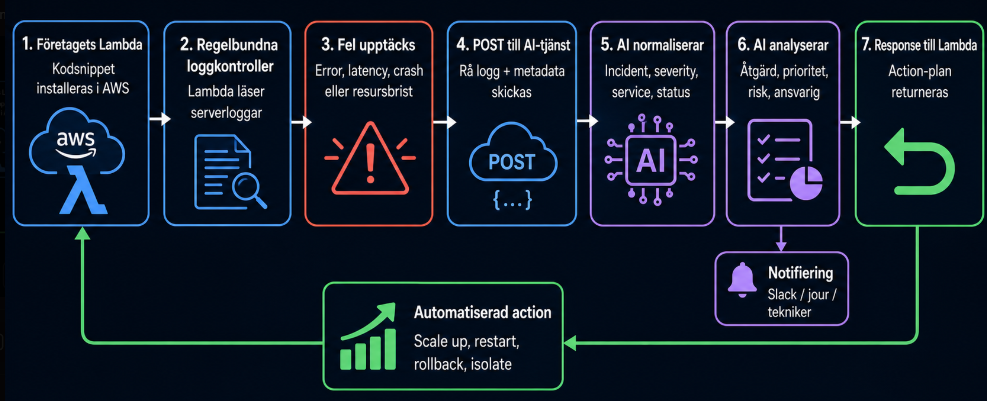

<p align="center">
  
</p>

<h1 align="center">AI Incident Manager</h1>

<p align="center">
  <strong>AI-assisted incident response showcase for modern operations teams.</strong>
</p>

## Preview

<p align="center">
  
</p>

AI Incident Manager is a portfolio-ready showcase of an AI-assisted incident response dashboard. It demonstrates how operational alerts can be classified, prioritized, assigned to the right owner, and followed up with simulated Slack/SMS notifications.

This project started as a project/examensarbete prototype and is now prepared as a frontend-first showcase. The architecture is designed to be highly scalable, and the product is still being improved.

## Showcase Version

The deployed portfolio version runs without a backend. The frontend includes seeded demo incidents, AI-style recommendations, ownership assignment, timeline views, filtering, a local technician roster, notification channel selection, and automatic notification simulation.

Slack and SMS are not actually sent in showcase mode. The UI displays messages such as `SLACK message sent (just simulation)` so the main flow can be tested safely in any browser.

## Flowchart



## Tech Stack

- Next.js 16
- React 19
- TypeScript
- Tailwind CSS
- Node.js / Express backend kept for review and future development
- MongoDB/Mongoose models in the backend prototype
- Socket.IO, Slack and SMS integrations in the backend prototype

## Run the Frontend

```bash
cd frontend
npm install
npm run dev
```

Open `http://localhost:5173`.

For a production build:

```bash
cd frontend
npm run build
```

## Backend Status

The `backend` folder is kept as reference code for the original prototype and future expansion. It includes Express routes, MongoDB models, AI analysis flow, Socket.IO events, and notification service integrations.

The portfolio showcase does not require the backend, database, Slack token, SMS provider, or local service setup.
